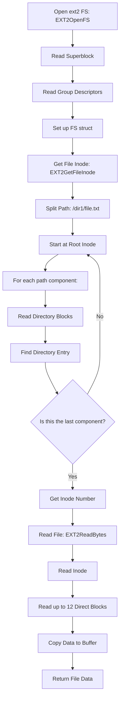

# Flowchart for EXT2 File System Parser

```mermaid
flowchart TD
    A[Open ext2 FS: EXT2OpenFS] --> B[Read Superblock]
    B --> C[Read Group Descriptors]
    C --> D[Set up FS struct]
    D --> E[Get File Inode: EXT2GetFileInode]
    E --> F[Split Path: /dir1/file.txt]
    F --> G[Start at Root Inode]
    G --> H[For each path component:]
    H --> I[Read Directory Blocks]
    I --> J[Find Directory Entry]
    J --> K{Is this the last component?}
    K -- No --> G
    K -- Yes --> L[Get Inode Number]
    L --> M[Read File: EXT2ReadBytes]
    M --> N[Read Inode]
    N --> O[Read up to 12 Direct Blocks]
    O --> P[Copy Data to Buffer]
    P --> Q[Return File Data]
```
